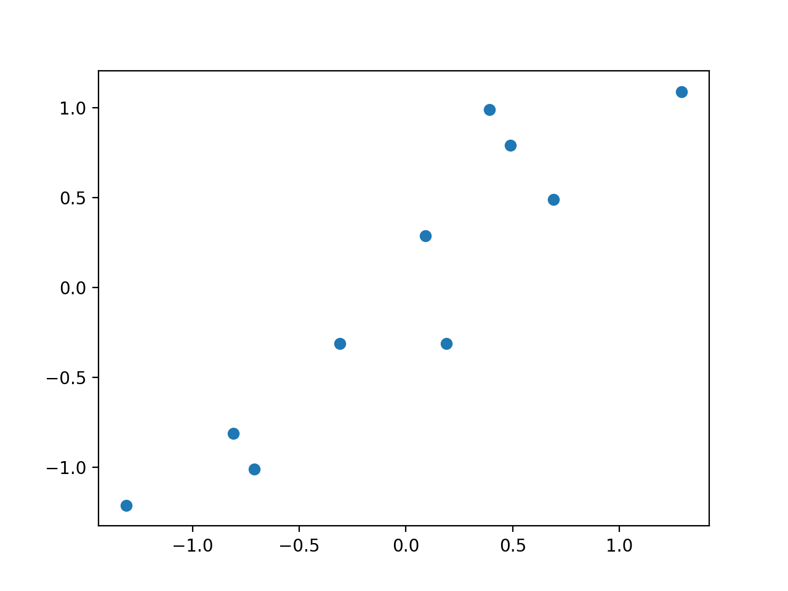

>[PCA(主成分分析)python实现](https://www.jianshu.com/p/4528aaa6dc48)
>[主成分分析（PCA）原理详解](https://zhuanlan.zhihu.com/p/37777074)

```
PCA两种实现
1. 基于特征值分解协方差矩阵实现PCA算法
2. 基于SVD分解协方差矩阵实现PCA算法

降维原理: 将n维特征映射到k维上, 在n维的基础上，构造出来k维度的特征。
- 基变化 = 相似矩阵

我们如何得到这些包含最大差异性的主成分方向呢？
- 1. 通过计算数据矩阵的协方差矩阵
- 2. 然后得到协方差矩阵的 特征值和特征向量，选择特征值最大 (即方差最大)的k个特征所对应的特征向量组成的矩阵。
- 3. 这样就可以将数据矩阵转换到新的空间当中，实现数据特征的降维。
```

```
降维时为什么找最大的特征值对应的特征向量?
特征向量表示  投影变换的方向
特征值表示    投影变换的强度

找最大的特征值是因为: 在降维之后要最大化保留数据的内在信息，并期望在所投影的维度上的离散最大
```
# 1. 基于特征值分解协方差矩阵实现PCA算法

## 1.1 Data Preprocessing
数据的规范化处理
```python
# (x - mu) / x_max - x_min
mu_x, mu_y = np.mean(x), np.mean(y)
x = x - mu_x
y = y - mu_y
```
data distribution:


## 1.2 Covariance Matrix 协方差计算

协方差: 协方差用于衡量两个变量的总体误差. 两个特征之间的独立性

例如: covariance.py
```
np.cov(data.T)
```


巧不巧, 矩阵可以这样表示

```
data = data.T
data[0] = data[0] - np.mean(data[0])
data[1] = data[1] - np.mean(data[1])
# 矩阵相乘
cov2 = np.dot(data, data.T)
```


总结:
```
如果有2个变量, i 和 j
- 求i的平均值 和 j的平均值
- i 和 j 依次相减对应的平均值
- np.cov() 或者 矩阵相乘的方式都能得到协方差矩阵
```

## 1.3 Eigenvectors and Eigenvalues 特征向量 特征值
**求协方差矩阵的特征根和特征向量**

x通过A矩阵的变化, 达到的效果 = lambda这个标量 * x

$Ax = \lambda x$
$(A - \lambda I) x = 0$

**$\lambda I$ 是个对角矩阵:** $A - \lambda I = 0$

**行列式为0**
也就是降了一个维度, 例如从2维, 降到了1维

**$det(A - \lambda I) = 0$**


## 1.4 选择 特征值(需要绝对值)最大 的那个特征向量
```python
eig_pairs = [(np.abs(eig_val[i]), eig_vec[:,i]) for i in range(len(eig_val))]
eig_pairs.sort(reverse=True)
feature = eig_pairs[0][1]

new_data_reduce = (np.dot(feature, data.T)).T
```

## 1.5 结果
(1) 数据预处理后: 红色的点
(2) 经过协方差矩阵计算 和 求解特征向量+特征值: 绿色的线和蓝色的线, 其中蓝色的线特征值最大
(3) 三角形: 经过 特征向量 矩阵的变化得到的值
(4) 星星: 选择特征值为最大的特征向量, 也就是蓝色的线. 红色点经过蓝色的线变化后, 变成了一维的星星。


## 1.6 附加另外计算


# 2. 基于SVD分解协方差矩阵实现PCA算法
见PCA其他
