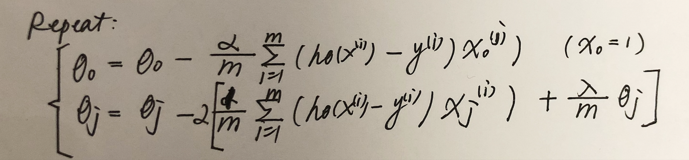

# Practice I

>[资料: 线性回归基础篇之预测鲍鱼年龄](https://cuijiahua.com/blog/2017/11/ml_11_regression_1.html)
>[资料: Jack-Cherish/Machine-Learning](https://github.com/Jack-Cherish/Machine-Learning/tree/master/Regression)


## 1. Recap

### 1.1 Dataset
- 1st column: $x_0 = 1$
- 2nd column: have 1 feautures $x_1$
- 3th column: $y$
<pre>
x0          x1          y
1.000000	0.067732	3.176513
1.000000	0.427810	3.816464
...
</pre>


### 1.2 Matrix Calculus
>[矩阵求导](https://blog.csdn.net/nomadlx53/article/details/50849941)
>[* Link: Coursera 4.7 正规方程及不可逆性](http://www.ai-start.com/ml2014/html/week2.html#header-n55)
>[* Link: 最小二乘法线性回归：矩阵视角](https://zhuanlan.zhihu.com/p/33899560)


## 2. 正规方程 vs 梯度下降
训练结果


### 2.1 正规方程 (def train)
**`Equation - theta`**  $\theta = (X^TX) ^ {-1} X^TY$

```python
def train (xArr, yArr):
    # Y => Y.T
    X, Y = np.mat(xArr), np.mat(yArr).T

    # 正规化: Matrix Caculus T=transpose I=inverse
    W = (X.T * X).I * (X.T * Y)
    return W
```

**正规方程, 求解$\theta$**


linear regression with regularization


### 2.2 梯度下降方法 (def train_gradient_descent)

**`Equation - J`** 
$J(\theta) = 1/2m * sum((h_{\theta}(x) - y) ^ 2)$

**`Equation - BGD`** 
$\theta = \theta - \alpha / m * (h_{\theta}(x_j) - y) * x_j$

```python
def train_gradient_descent (xArr, yArr):
    X, Y = np.mat(xArr), np.mat(yArr).T
    m, n = X.shape # 200, 2
    weights = np.ones((n, 1)) #[[1], [1]] n*1
    
    alpha = 0.01
    loop_num = 1000
    
    for i in range(loop_num):
        # 1/m * X.T * (XW - y)
        weights -= alpha * 1/m * (X.T * (X * weights - Y))
    return weights
```

**梯度下降, 求解$\theta$**
