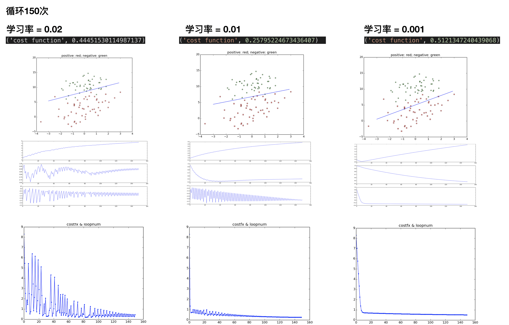
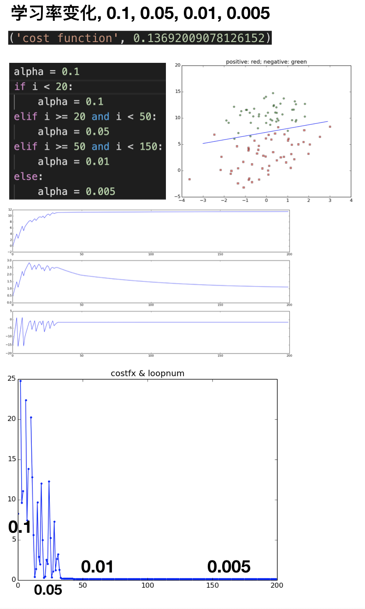
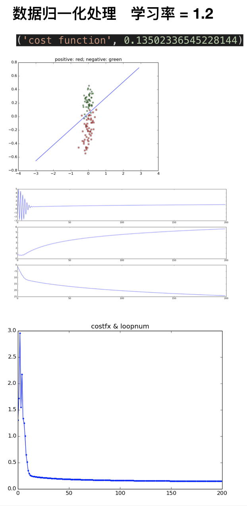

# Logistic Regression

```
1. Equation
2. [optimize] learning rate
3. [optimize] gradient descent (bgd, sgd, mbgd)
4. [optimize] feature scaling, mean normalization
5. [optimize] Regularization
```

# 0. Equation

```
1. z = theta^T x
2. sigmoid function = g(z)
3. h(x) = g(z) = 1 / 1 + e^-z
4. J(theta) = 1/m_sum( -ylog(h(x)) - (1 - y)log(1 - h(x)))
5. gradient descent:
theta = theta - alpla dJ(theta)/theta
dJ(theta)/theta = (h(x) - y)x
```


# 1. $\alpha$ learning rate

## 1.1 学习率 - 选取
```python
迭代150次
alpha学习率分别是 0.02, 0.01, 0.001

图从上到下, 分别是
- 拟合图
- theta0, theta1, theta2 和 迭代次数的关系图
- J(theta) 代价函数 和 迭代次数的关系图
```

(1) 0.02, 步调太大, 无法很好converge
(2) 0.01, 看起来比较适中
(3) 0.001, 步调太小, 欠拟合(unfit)




## 1.2 学习率 - 从快到慢 (optimization)
```python
迭代150次
alpha学习率阶段关系为: 0.1, 0.05, 0.01, 0.005

从最终代价函数来看, 比上面三个图要好
```



# 2. Feature Scaling 特征缩放 (optimization)

```python
Speed up gradient descent：

"feature scaling": 特征值缩放
"mean normalization": 均值归一化处理

随机梯度下降效率变高
该例子, 可以做到, 在迭代12次的时候, 就可以收敛的很好。
```


```python
# practice_4_regularization.py
def loadData ():
    fr = open('./dataset.txt')
    data_mat, label_arr = [], []
    x1_arr, x2_arr = [], []

    for linestr in fr.readlines():
        lineArr = linestr.strip().split()
        x1_arr.append(float(lineArr[0]))
        x2_arr.append(float(lineArr[1]))

        data_mat.append([1.0, float(lineArr[0]), float(lineArr[1])])
        label_arr.append(int(lineArr[2]))   
    fr.close()
    
    # === feature scaling & mean normalization ===
    x1_mean = np.mean(x1_arr)
    s1 = max(x1_arr) - min(x1_arr)
    
    x2_mean = np.mean(x2_arr)
    s2 = max(x2_arr) - min(x2_arr)
    
    X = np.mat(data_mat)
    X[:, 1] =  (X[:, 1] - x1_mean) / s1
    X[:, 2] =  (X[:, 2] - x2_mean) / s2
    # === end ===

    # 原来不处理的输出 return data_mat, label_arr
    return X, label_arr
```

# 3. Gradient Descent

```python
# ./basic/practice_1_bgd.py
# ./basic/practice_2_sgd.py
# ./basic/practice_3_mbgd.py
1. bgd
2. sgd
3. mbgd
```

# 4. Regularization
