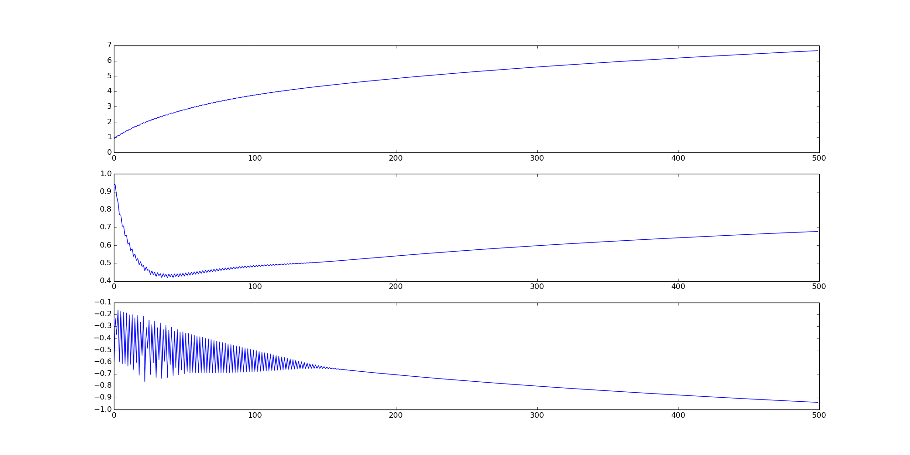

>[Logistic Regression 对逻辑回归代价函数求偏导](https://cuijiahua.com/blog/2017/11/ml_6_logistic_1.html)

- (批量梯度下降) practice_1_bgd.py

# Batch Gradient Descent 批量梯度下降

## 1. Recap 
逻辑回归 推导 梯度下降算法

- 有m = 100个样本, 循环迭代 n = 200次
- 每次(n)迭代学习, 需要将所有m个样本的 代价函数和的平均值, 带入到公式中
- 整个过程叫做 **批量 batch gradient descent**
- 好处是: 噪点少, 整体朝着最优解方向走
- 坏处是: 数据量大的时候, 该方案预算速度会特别的慢, 效率低, 也就是说收敛的速度慢。
(解释: 例如模型是个$w0x0 + w1x1 + w2x2$, 每一次(n)迭代, 需要100 * 3次乘法 和 100 * 2次加法)


## 2. 回归系数w 和 迭代次数 的关系
```python
draw_weights_loopnum (weights_loopnum_mat): 
  ....
```

### 2.1 关系I
- 学习率: 0.01
- 迭代次数: 500
- 导数: (除以总数 n = 3) **`斯坦福课程有 / n 的说明 , 所有导数和的平均值`**
```python
weights_3_1 -= alpha * dW_3_1 / n
```

- 图: 大约在**150次**, 收敛趋于稳定



### 2.2 关系II (参考: 仅看收敛的速度)
- 学习率: 0.01
- 迭代次数: 500
- 导数: [Logistic Regression 对逻辑回归代价函数求偏导](https://cuijiahua.com/blog/2017/11/ml_6_logistic_1.html) 这里课程并没有## 2.1 关系I 对所有导数和的平均值求解, 仅是导数和
```python
weights_3_1 -= alpha * dW_3_1
```
- 图: 大约在**300次**, 收敛趋于稳定
- 300次收敛速度很慢。150次倒也不快。


### 2.3 图
- alpha: 常量变化
- 迭代次数: 500


### 2.4 总结
- 还是需要看2.1的例子, 2.2 仅做参考
- README_2.md 介绍 **随机批量下降**


## 3. code
```python
def train(data_mat, label_arr):
    alpha = 0.01 # learning rate
    loopnum = 500 # repeat counts
    
    X_100_3 = np.mat(data_mat) # (100 * 3) [ [1, xx, xxx], [1. xx, xxx ], ... ]
    y_100_1 = np.mat(label_arr).transpose() # (100 * 1) [[y1], [y2], ... ]
    
    """
    (1) z(x) = w0x0 + w1x1 + w2x2 + ... = X * w
    (2) h(x) = g(z) = sigmoid(z)
    (3) dW_xj = (y - h(x)) * xj
    (4) weights = weights + alpha * dW_xj
    (5) repeat (1) => loopnum
    """
    m, n = np.array(X_100_3).shape # m=100, n=3
    weights_3_1 = np.ones((n, 1)) # [ [1], [1], [1] ]
    
    # 绘图使用: weights数据 和 迭代次数 的关系
    weights_loopnum_arr = np.array([])

    # 批量梯度下降: batch gradient descent
    for i in range(loopnum):
        # (1) z
        z_100_1 = X_100_3 * weights_3_1
        # (2) h
        h_100_1 = sigmoid(z_100_1)
        # (3) derivative
        dW_3_1 = X_100_3.T * (h_100_1 - y_100_1)
        # (4) weights
        weights_3_1 -= alpha * dW_3_1 / n
        
        # 绘图使用: weights数据 和 迭代次数 的关系
        weights_loopnum_arr = np.append(weights_loopnum_arr, weights_3_1)

    """
      例如: weights_loopnum_arr = [1, 2, 3, 4, 5, 6], 循环2次
      loopnum = 2, n = 3
      分为2行3列的矩阵
    """
    weights_loopnum_mat = weights_loopnum_arr.reshape(loopnum, n)
    return weights_3_1, weights_loopnum_mat
```