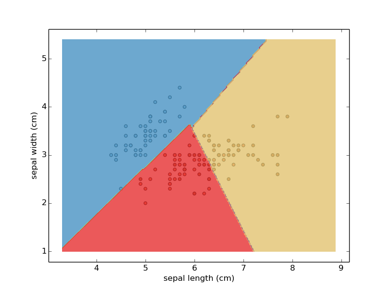
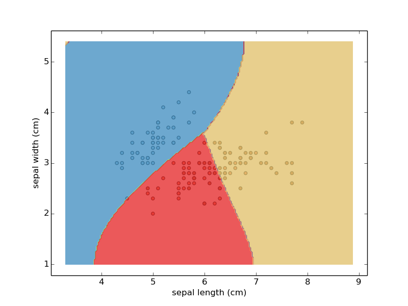
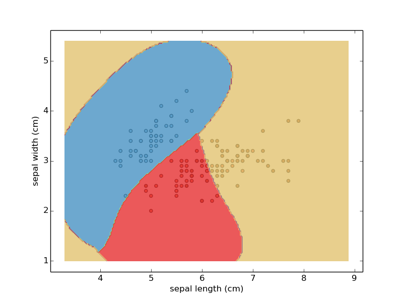
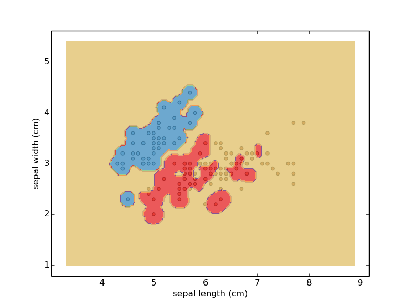
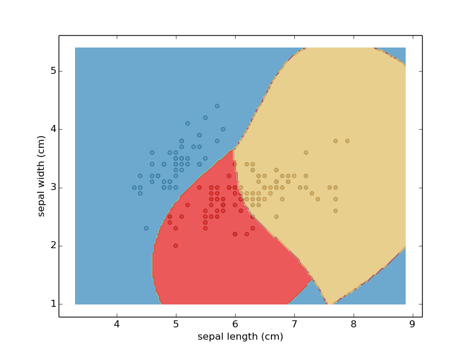

# Support Vectors Machine

>[Link: 机器学习实战-支持向量机原理、Python实现和可视化（分类）](https://zhuanlan.zhihu.com/p/77450726)
>[Pandas](https://www.pypandas.cn/)


# 1. from sklearn import svm

- kernel 内核选择: ‘linear’, ‘poly’, ‘rbf’, ‘sigmoid’
- gamma kernel的内核系数: 伽马值越高，则会根据训练数据集进行精确拟合，也就是泛化误差从而导致过拟合问题
  
## 1.1 kernel = linear
```python
# kernel='linear' 内核选择 线性
svc = svm.SVC(kernel='linear', C=1, gamma='auto').fit(X, y)
```


## 1.2 kernel = rbf
径向基函数(RBF) Radial basis function
*避免过度拟合
```python
svc = svm.SVC(kernel='rbf', C=1, gamma='auto').fit(X, y)
```


## 1.3 gamma = 1
```python
svc = svm.SVC(kernel='rbf', C=1, gamma=1).fit(X, y)
```


## 1.4 gamma = 100
```python
svc = svm.SVC(kernel='rbf', C=1, gamma=100).fit(X, y)
```



## 1.5 C = 10
误差项的惩罚参数C. 它还控制了平滑决策边界与正确分类训练点之间的权衡
```python
svc = svm.SVC(kernel='rbf', C=10, gamma='auto').fit(X, y)
```

