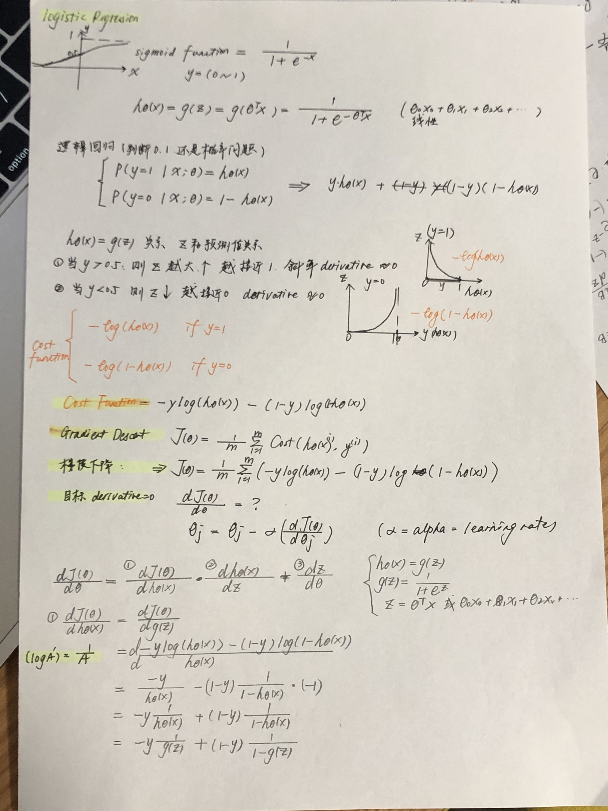
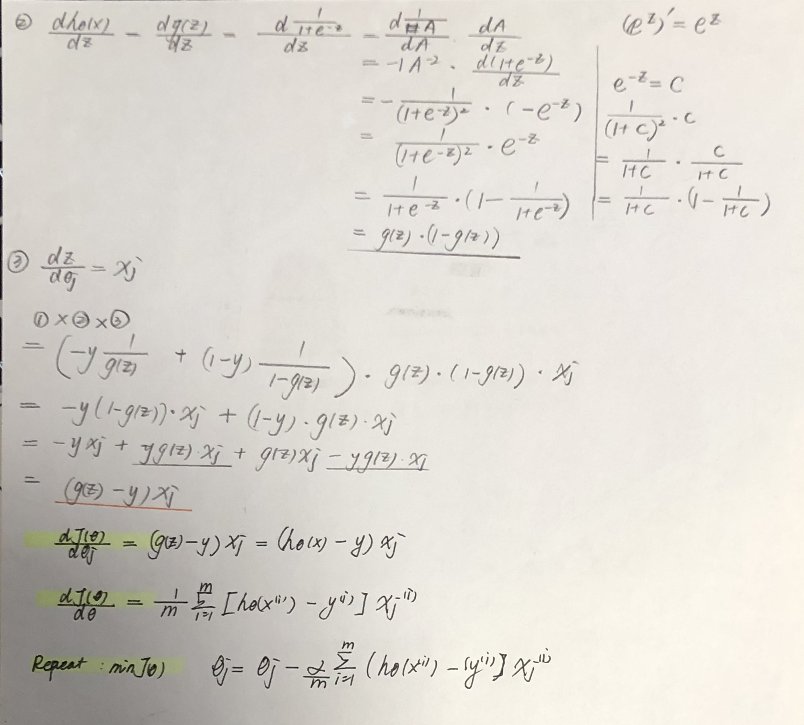
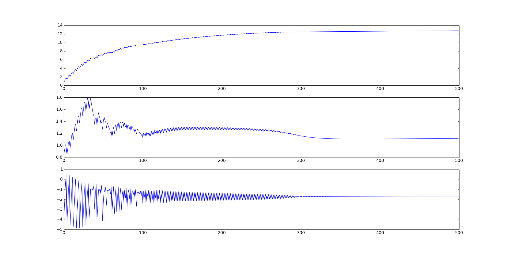

>[Logistic Regression 对逻辑回归代价函数求偏导](https://cuijiahua.com/blog/2017/11/ml_6_logistic_1.html)

- 基础用法: practice_1.py

# 1. Recap 逻辑回归 推导 梯度下降算法
[image](https://wx3.sinaimg.cn/mw1024/0074cDOyly1gcesrpowsyj30u015tb29.jpg)




# 2. 回归系数w 和 迭代次数 的关系
```python
draw_weights_loopnum (weights_loopnum_mat): 
  ....
```

## 2.1 关系I
- 学习率: 0.01
- 迭代次数: 500
- 导数: (除以总数 n = 3) **`斯坦福课程有 / n 的说明 , 所有导数和的平均值`**
```python
weights_3_1 -= alpha * dW_3_1 / n
```

- 图: 大约在**150次**, 收敛趋于稳定


## 2.2 关系II 
- 学习率: 0.01
- 迭代次数: 500
- 导数: [Logistic Regression 对逻辑回归代价函数求偏导](https://cuijiahua.com/blog/2017/11/ml_6_logistic_1.html) 这里课程并没有## 2.1 关系I 对所有导数和的平均值求解, 仅是导数和
```python
weights_3_1 -= alpha * dW_3_1
```
- 图: 大约在**300次**, 收敛趋于稳定
- 300次收敛速度很慢。150次倒也不快。



## 2.3 总结
- (在大量数据情况下) 如何提高收敛的速率?
- 如何改进**随机梯度下降**算法? (收敛速度, 不仅和迭代次数有关, 还和learning rate相关)
