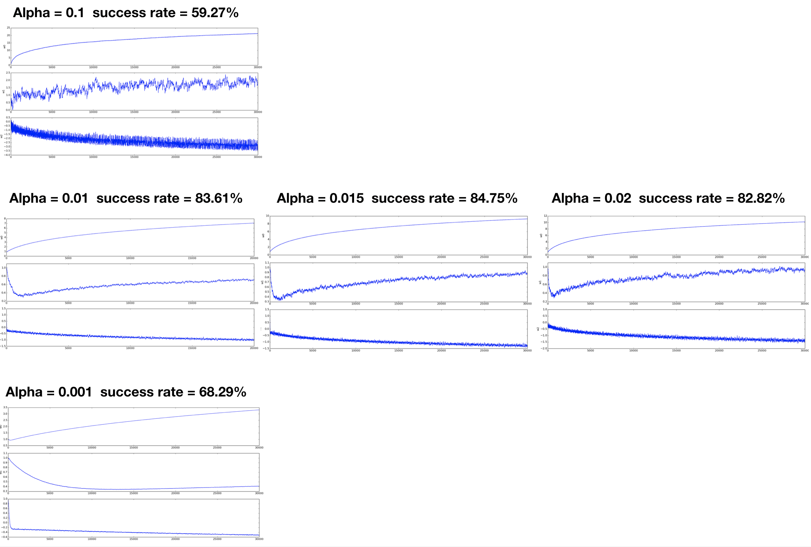
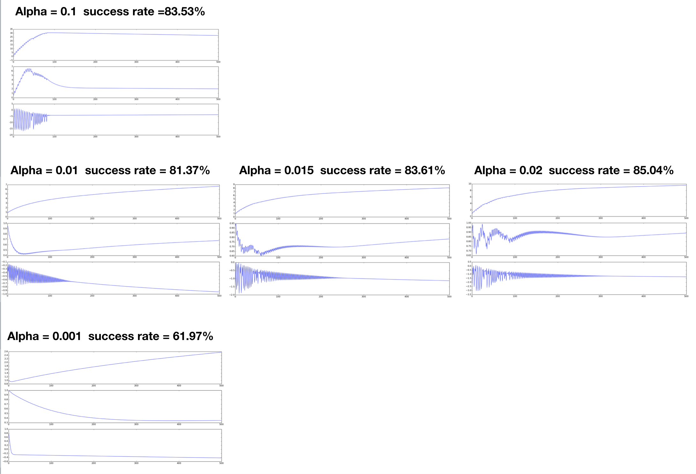

>[Logistic Regression 随机梯度下降算法 - 优化](https://cuijiahua.com/blog/2017/11/ml_7_logistic_2.html)

- 随机梯度下降: practice_2_sgd.py

# Stochastic Gradient Descent 随机梯度下降 + 动态学习率

## 1. Recap
- 详见 README_1_bgd.md

### 1.1 提出问题? 
practice_1_bgd.py中, 有100个数据样本 (基础模型
z = w0x0 + w1x1 + w2w2; then g(z))。
也就是说, 每次计算, 都需要100 * 3次的乘法 和 100 * 2 次的加法 = 500次的运算。
如果我们有一千万个数据样本呢? 每次训练, 都需要 所有数据的 cost function 之和, 运算效率是非常的低。


## 2. 随机梯度下降 SGD

随机也就是说我每次用样本中的一个例子来近似我所有的样本，用这一个例子来计算梯度并用这个梯度来更新。

因为每次只用了一个样本, 因而容易陷入到局部最优解中。也就说, 很容易noise, 有波动。

## 3. 问题
(1) `[2020.03.03]` alpha = 0.001 + 4 / (1 + j + i)? 为什么如此, 开始步子迈的大4.01, 后面收敛到0.02?
?????????


(2) `[2020.03.03 疑问]` 每一次迭代, 都对每个样本随机的选取, 训练权重, 并且不重复, 目的是为什么? 迭代次数不是增加了吗?

`[2020.03.05 回答]`
随机的选取样本, 并非像 bgd 批量随机梯度, 是用整个样本数据进行训练(样本量如果很大, 对效率是个负担, 虽然收敛效率好)。迭代次数是增加了, 增加就增加呗, 效率提升了。


## 4. 代码

- 每次迭代, 仅用某一个随机的样本, 算derivative(非全部样本), 第一次完整迭代结束后, 所有样本均参与对权值的影响。

```python
# 训练
def train (data_mat, classify_arr):
    m, n = np.array(data_mat).shape # m = 100(样本数量) n = 3(有三个权重)
    # 初始化 weights [1. 1. 1.]
    w_1_3 = np.ones(n)
    # 学习次数
    loopnum = 200
    # 学习率 alpha = 0.01
    
    data = np.array(data_mat)
    # 绘图使用: 权重和迭代次数的关系
    weights_loopnum_arr = []
    
    # 随机梯度下降算法 ((1) 并非对矩阵操作, 是对数组(一组数据) 操作 (2) 学习率也有所变化)
    for i in range(loopnum):
        # 暂存列表(目的: 每次训练样本不重复, 从中随机选一个样本值, 作为梯度下降导数计算)
        _templist = list(range(m)) # 例如 m = 5 _templist: [0, 1, 2, 3, 4]

        # m = 100个样本, 对每个样本进行迭代计算权重值, 并每次训练样本不重复
        for j in range(m):
            # 降低alpha的大小，每次减小 1 / (j + i), i和j有可能为0会出错的所以(i + j + 1)
            alpha = 0.01 + 4 / (1 + j + i)
            # alpha = 0.01 + 10 / (1 + j + i)
            
            # 从_templist中, 选择个随机数
            random_index = int(random.uniform(0, len(_templist))) # 从0-_templist, 随机选个index
            random_index_in_templist = _templist[random_index] # 在暂存列表中的某个值
            x_1_3 = data[random_index_in_templist] # 选取当前值
            y_1_1 = classify_arr[random_index_in_templist] # 当前y_true值

            # 1. z 一个值 这里容易出错 [1,2,3]*[1,2,3] = [1,4,9] = sum(14)
            z_1_1 = sum(x_1_3 * w_1_3)
            # 2. h(x) = g(z)
            h_1_1 = sigmoid(z_1_1)
            # 3. derivative
            # *核心: 这里是和BGD不同的地方
            dw_1_3 = x_1_3 * (h_1_1 - y_1_1)
            # 4. weight
            w_1_3 = w_1_3 - alpha * dw_1_3
            
            # 将w_3_1 放入至weights_loopnum_arr数组中
            weights_loopnum_arr = np.append(weights_loopnum_arr, w_1_3, axis=0)
            del(_templist[random_index])
            
    # 处理weights_loopnum_arr
    weights_loopnum_mat = weights_loopnum_arr.reshape(loopnum * m, n)
    return w_1_3, weights_loopnum_mat
```

## 5. 回归系数w 和 迭代次数 的关系

**`SGD 随机梯度下降(practice_2_sgd.py)`**
- alpha: 常量变化
- 迭代次数: 300


特点:不像BGD每次都是用所有样本值进行迭代, **收敛速度会有提升**, 但迭代次数增加, 且**噪点较大, 浮动明显**
问题可能是: 每次只用一个样本, **容易陷入局部最优**。


**`BGD 批量梯度下降(practice_1_bgd.py)`**
- alpha: 常量变化
- 迭代次数: 500


特点: 因为是所有样本值的误差和的平均, 所以**收敛速度较慢,** 且一次收敛的幅度较大
好处是, 整体是可以求出一个**标准梯度**。

## 6. 动态学习率 对 SGD的影响
- alpha: 动态变化
- 迭代次数: 300

(1) 第一张图: 常量学习率, 收敛速度很慢, 波动较大
(2) 第二张图和第三张图: 核心是用的动态学习率变化 
- $\alpha \in [2.01, ..., 0.014]$ 
  0.01 + 2 / 1 + 300 + 200 = 0.014
- $\alpha \in [10.01, ..., 0.03]$


## 7. 总结
- 动态学习率: 减少SGD的波动, 可以很好的收敛
- SGD优势在于, 计算效率提升, 收敛速度较快, 但是波动较大, 结合动态学习率解决。(但容易陷入局部最优)